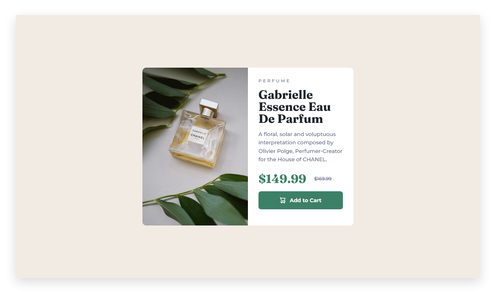

# Frontend Mentor - Product preview card component solution

This is a solution to the [Product preview card component challenge on Frontend Mentor](https://www.frontendmentor.io/challenges/product-preview-card-component-GO7UmttRfa). Frontend Mentor challenges help you improve your coding skills by building realistic projects.

## Table of contents

- [Overview](#overview)
  - [The challenge](#the-challenge)
  - [Screenshot](#screenshot)
  - [Links](#links)
- [My process](#my-process)
  - [Built with](#built-with)
  - [What I learned](#what-i-learned)
  - [Continued development](#continued-development)
  - [Useful resources](#useful-resources)
- [Author](#author)
- [Acknowledgments](#acknowledgments)

## Overview

### The challenge

Users should be able to:

- View the optimal layout depending on their device's screen size
- See hover and focus states for interactive elements

### Screenshot




### Links

- Solution URL: [Add solution URL here](https://your-solution-url.com)
- Live Site URL: [Add live site URL here](https://your-live-site-url.com)

## My process

### Built with

- Semantic HTML5 markup
- SCSS custom properties
- Flexbox
- Mobile-first workflow

### What I learned

I am glad that I could figure out how to make image not scale down when using flex-box

```css
.card-image {
  flex: 1;
  min-width: 50%;
}
```

### Continued development

I find flex-box and SASS very useful, so I want to refine these skills for the future projects.

### Useful resources

- [Flexbox and Truncated Text](https://css-tricks.com/flexbox-truncated-text/) - This is an amazing article which helped me the relation between flex-prarent and flex-child. I'd recommend it to anyone still learning this concept.

## Author

- Frontend Mentor - [NT-squared](https://www.frontendmentor.io/profile/nt-squared)
